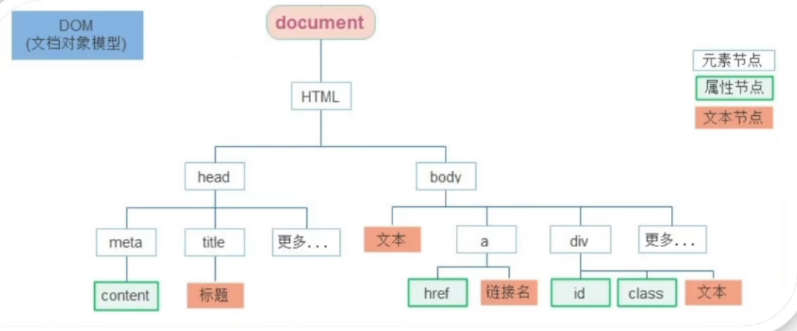

# javascript

## 何为编程？

### 编程即编写程序

编写：通过在 word, vsc, 记事本等编辑器上编写并保存为有特定后缀的文件  

程序：（泛指网站 脚本 软件 系统 之类的东西）分为数据和函数两个部分

**数据：具体为数字 文字 图片 视频（即保存在硬盘中的电子）**

**函数：（具体为点击 滑动 计算 运行等交互；类似于功能） 接受输入参数--> 处理参数--> 输出结果的过程（函数可以套娃嵌套）**

### 编程就是是编写函数去处理数据

**由数据量大小和处理逻辑的复杂程度决定其难度**

***判断为处理参数中最重要的处理方法***

### 编程的核心为函数计算的过程

其由运算符号（+-*/等）和控制结构（判断 循环等）构成

### 现实中的许多东西都可以看为特别复杂的程序（由各种函数嵌套而成）

***例如学习就是增加我们数据量并优化处理数据的函数的过程***

---


## js 语言

### 是什么

一种运行在客户端（浏览器）的编程语言，实现人机交互

属于弱数据类型语言，变量属于哪种类型，只有赋值之后，才能确认

java 是强数据类型     例如： int a = 3     必须是整数

### 作用

+ 网页特效（监听用户行为作出对应反馈）
+ 表单验证（针对表单数据合法性进行判断）
+ 数据交互（获取后台数据，渲染到前端）
+ 服务端编程（node.js）

### js 组成


#### ECMAScript

规定 js 核心语法知识，如：变量，分支语句，循环语句，对象等

#### Web APIs

DOM 操作：文档，比如对页面元素进行移动、大小、添加删除等操作

eg: 留言，评论

BOM 操作：浏览器，比如页面弹窗，检测窗口宽度、存储数据到浏览器等等

### ECMAscript

#### 书写

##### 插入

+ 内部：写在 </body> 上方（浏览器按顺序加载）``

```javascript
<script>
    alert('弹窗提示')
</script>
```

+ 外部 js

```javascript
<script src="my.js"></script>
```

**外部 js 中间不要写代码**

+ 内联 js

```javascript
<button onclick='alert'('逗你玩~~~')>点击我月薪过万</button>
```

##### 注释

+ **注释：单行 `//`     多行 `/**/`）**

##### 结束语

+ 结束语     ;     可写可不写但要统一

#### 输入与输出

##### 输出

1.document.write(`我是div标签`)/（`<h1>我是一级标题</h1>`）**注意反引号**

作用：1.向 body 页内输出内容

​           2.输出标签，可解析为网页元素

2.alert(‘要出的内容’)

作用：页面弹出警告对话框

3.console.log(‘控制台打印’)

`console.log(age)`

作用：控制台输出语法，供调试用

##### 输入

1.prompt(‘请输入你的年龄： ’)

作用：包含提示信息，提示用户输入文字

##### 字面量

定义：描述事或物

eg: 1.工资 1000      数字字面量；

​     2.“字符串”        字符串自变量； 

​     3.[]                    数组字面量；

​     4.{}                   对象字面量

​     5.true false     布尔型字面量

#### 变量

定义：存储数据的容器

本质：程序在内存中申请的一块用来存放数据的小空间

内存：不同于硬盘，关机后即消失，是实时的

##### 声明和赋值

+ let 变量名 = 值

```javascript
let age
age = 18
let name = "字符串"
```

```javascript
//不可重复声明相同变量
let age = 18
    age = 19
console.log(age)
```

```javascript
//声明多个变量
let age = 18, uname = 'pink'
//更推荐多行声明
```

**规则**

1.不能用关键字命名

2.数字不开头     可用下划线字母$开头

3.严格区分大小写

**规范**

1.起名有意义

2.驼峰命名     myName

##### let 和 var 的区别

var:

1.可以先使用再声明

2.可以重复声明变量

3.污染全局变量，没有块级作用域

##### 数组

格式：`let key = ['小明','小红','小白']`     `let arr = [10,20,30]`

特性：有序                     0           1           2                                     0    1    2   （索引或下标）

使用：`console.log(arr[0])`

#### 常量

注意：常量不许重新赋值，且在声明时就应对其初始化

**声明** `const age = 18`

#### 数据类型

##### 基本数据类型

+ number          数字型

​       整数，小数，正数，负数

​       运算符号与其他语言一样

+ string              字符串型 

​       使用     ‘ ’   “ ”    包裹的数据                                  **或为用户输入内容**

​      **字符串拼接**

​      `console.log('王' + '八蛋')`                    输出          王八蛋

​      `console.log('我今年' + age)`                 可以连接字符串和其他数据类型包括变量

​      `console.log('我今年${age}岁了')`          还可以内嵌变量

**‘’单引号字符串不能插入变量，``模板字符串才能插入${变量}$**

+ boolean          布尔型

​       只有两个值     true      false

​       `let treeFalse = true`

​       `console.log( 3 > 4 )`         输出为 false

​       **false**:’’,0, undeined, null, NaN


+ undefined      未定义型

​       在声明变量不赋值的情况下，变量默认值为 undefined，一般很少为某个变量赋值 undefined

​       作用：通过检测变量值是否为此，判断用户是否发送数据

```javascript
let num
console.log(num)
```

​       若 `console.log(undefined + 1)` 将会输出 NaN (Not a number)

+ null                  空类型

​       仅仅代表“无”、“空”   或     “值未知”    的特殊值

​      `let obj = null`

与 undefined 的区别：undefined 表示没有赋值

​                                      null 表示赋值了，但是内容为空（没想好赋啥值先给个空）

##### 引用数据类型

+ object             对象                      

​                                       

##### 检测数据类型

typeof 关键字检测数据类型

作用：返回被检测的数据类型

语法：   typeof x

typeof(x)

```javascript
let num = 10
console.log(typeof num)              输出number
let str = 'pink'
console.log(typeof str)               输出string
```

#### 类型转换

使用表单、prompt 获取的数据默认为字符串类型

`console.log('1000' + '200')`      输出为 1000200        不能进行正常加减

##### 隐式转换

`console.log(1 + 1)`                     输出 2

`console.log('pink' + 1)`          输出 pink1        系统自动将 1 转换为字符串

`console.log('pink' - 1)`          输出 NaN          **将非数字字符串转化为 NaN**

`console.log(2 - '2')`                输出 0                  -将‘2’转换为数字

`console.log(+'123')`                  输出 123             +将 ’123’ 转换为数字

`console.log(‘’ - 0) `                输出 0


**除+以外的其他运算符会自动将其转换为数字类型**

##### 显式转换

主动转换（转换为数字类型）

+ Number                             转换为数字 12.35
+ parseInt                             只保留整数 12
+ parseFloat                         可以保留小数 12.35

```javascript
let num = '123'
console.log(Number(num))//输出为123
let num = Number(prompt('请输入数字'))
let num = +prompt('请输入数字')
console.log(Number('pink'))//输出NaN
```

+ Boolean（）                              转换为布尔型

#### 运算符

##### 赋值与自增

+ 与 C 语言一致
+ 如++i/i++    常用于计操作次数 

       ```JavaScript
       let a = 1
       console.log(++i + 1)      输出3 //先自加再运算
       let b = 1
       console.log(i++ + 1）     输出2 //先运算再自加
       console.log(i)            输出2
       ```

##### 比较

**只返回 true/false**

+ 一般与 C 一致

+ == 左右两边值是否相同
+ === 类型和值是否相同
+ ！== 左右两边是否不全等

**内有隐式转换，将字符 3 转换为数字 3 再比较，但类型不同**

+ 字符串比较 A 码，从第一个字母开始比，相同就比第二个，中文会转化为拼音

##### 逻辑

+ && 逻辑与（并且）     要求两边都为真
+ ||  逻辑或（或者）     要求有一方真
+ ！  逻辑非（取反）      真变假，假变真

**逻辑中断**

+ 短路：只存在于 &&和 Ⅱ 中，当满足一定条件会让右边代码不执行
+ 原因：通过左边能得到整个式子的结果，因此没必要再判断右边
+ 运算结果：无论&&还是 Ⅱ，运算结果都是最后被执行的表达式值，一般用在变量赋值

1. && 左边为假就直接输出左边，同时不执行右边
2. ||左边为假就执行右边，左边为真就执行左边

```javascript
function fn(x, y) {
X=X || 0
y=y || 0
console.log(x +y)
}//相当于给形参赋值
```


#### 语句

**与表达式的区别**

不一定有值

+ 顺序结构：从上往下
+ 分支结构：条件
+ 循环结构：条件

##### 分支语句

**非 0，‘’为真**（包括字符串）

##### if

  单分支，一个主体 if

  双分支，if     +     else

```javascript
if(){
    
}else if(){
    
}else if(){
    
}else{
}
```


##### 三元

​               格式：条件？代码 1: 代码 2     若为真则为代码 1 反之代码 2

         ```javascript
         console.log('(3 > 5 ? 3 : 5)')
         ```

​              使用：相当于双分支 if     一般用来取值

`let a = 3 > 5 ? 3 : 5`


##### switch

​                   使用：一般用于等值判断，而不是区间判断

​                   注意：break，否则造成 case 穿透

                   ```javascript
                   switch(变量){
                       case 值:
                           代码
                         break
                       case 值:
                           代码
                         break
                       default:
                           代码
                         break
                   }
                   ```

#### 循环语句

##### while

+ 推荐用于不明确使用次数的

```javascript
while(循环条件){
    代码(循环体)
}
```

注意：无终止条件会变成死循环

##### 循环退出

+ break                退出循环

```javascript
let i = 1;
            while (i <= 5) {
                if (i === 3) {
                    break;
                } //退出整个循环}
                console.log(`我要吃第${i}个包子`);
                i++;
            }
```

用于得到结果后排除某循环

+ continue           结束本次循环，继续下次循环

  ```javascript
  while (i <= 5) {
                  if (i === 3) {
                      i++//若无i++，会因为i永远等于3变成死循环
                      continue;
                  } //退出整个循环}
                  console.log(`我要吃第${i}个包子`);
                  i++;
              }
  ```

  用于排除某个循环

##### for

+ 推荐用于明确使用次数

+ 作用：重复执行代码

  ```javascript
  for(变量起始值let i =1;终止条件i <= 3;变量变化量i++){
      //循环体
  }
  ```

  for 循环像一个计数循环：设定一个计数器，初始化它，然后在计数器 **到达某值之前**，重复执行循环体
  而 **每执行一轮循环**，计数器值以一定步进进行调整
  比如加 I 或者减 I

+ 循环嵌套

```javascript
for（外部声明记录循环次数的变量；循环条件；变化值）{
     for（内部声明记录循环次数的变量；循环条件；变化值）{
                                           循环体}
}
```

#### 数组

+ 定义：按顺序保存数据的数据类型
+ 使用：用一个变量保存多个数据          `let arr =[1,’2’,’3’,true]`
+ 一些术语：
  + 元素：数组中保存的每个数据都叫数组元素
  + 下标：数组中数据的编号
  + 长度：数组中数据的个数，通过数组的 length 属性获得               

```console.log(names[0])门小明
let names = ［'小明'，‘小刚'，‘小红'，‘小丽'，‘小米"]
console.log（names[1]）// 小刚
console.log(names.length)// 5
```

##### 遍历数组(重点)

```let nums=[10,20,30,40,50]
for（let i = 0;i < nums.length;i++）{
             document.write(nums[i])
             }//将数组内容挨个输出
```

```javascript
let arr = ['pink', 'red', 'blue']
for (let k in arr){
console.log（k）// 数组的下标索引号,但是是字符串'0''1'...
console.log(arr[k]) // arr[k]
}
```


##### 操作数组

1. 查询数组数据     

   arr [0]

2. 重新赋值             

   数组 [下标] = 新值

   ```JavaScript
   for(leti=0;i<arr.length;i++){
                arr[i]=arr[i]+'老师'
   }
   ```

3. 新增数据

   + arr.push()将一个或多个元素添加到数组 **末尾**，并 **返回该数组新长度**

   + arr.unshift()添加到 **开头**，并 **返回该数组新长度**

   ​       arr.push(元素 1，···，元素 n)

         ```javascript
         let arr = ['pink','hotpink']
         arr.push('deeppinnk','lightpink')
         //['pink','hotpink','deeppink','lightpink']       
         ```

4. 删除

+ arr.pop()删最后一个数, 并返回其值

       ```javascri
       let arr = ['red','green','blue']
       console.log(arr.pop())//blue
       arr.pop()
       arr.pop()
       console.log(arr)//['red']
       ```

+ arr.shift()删除第一个数，并返回其值
+ arr.splice(起始位置（从零开始）, 删除几个元素)

#### 函数

作用：减少冗余代码，减少代码量

##### 声明

```javascript
function (函数名)sheet99(参数列表){
    for (let i = 1; i <= a; i++) {
                for (let n = 1; n <= i; n++) {
                    document.write(`<span>${i} * ${n} = ${i * n}</span>`);
                }
                document.write("<br>");
            }
}
```

##### 引用（调用）

`/函数名()/      sheet99()`

命名规范：

+ 和变量命名基本一致
+ 尽量小驼峰式命名法
+ 前缀应该为动词
+ 命名建议：常用动词约定

1. can                                     判断是否可执行某个动作
2. has                                     判断是否含义某个值
3. is                                        判断是否为某个值
4. get                                     获取某个值
5. set                                     设置某个值
6. load                                  加载某些数据

##### 函数传参

```JavaScript
function getSum(start'形参',end'形参') {
                let sum = 0;
                for (let i = start; i <= end; i++) {
                    sum += i;
                }
                document.write(`${sum}`);
            }
            getSum(30'实参',50'实参')//实参可以是变量，参数过多不传入
```

**可以给形参赋默认值** 防止引用时未输入实参输出 undefined 或 NaN

##### 返回值

作用：剔除函数内部的结果输出，将其保存，方便使用。同时结束函数

格式：

```javascript
function fn(){
    return 20
}
//相当于return执行了fn() = 20
console.log(fn())         //输出20
```

##### 作用域

定义：决定代码可使用的范围/先局部再全局

```javascript
function fn() {
    num = 10;  // 函数定义，此时num被当作全局变量
}
fn();          // 函数调用 - 执行函数体内的代码，函数定义了但未执行，需要调用执行
console.log(num);  // 输出 10
```


###### 全局作用域

+ script 标签内的变量
+ js 文件内的变量

###### 局部作用域

+ 函数内部变量
+ 循环内部变量

##### 匿名函数

```javascript
function fr(){}//具名
function (){}  //匿名
```

无名字无法直接使用

使用方式：

1. 函数表达式（web API）

```JavaScript
let fn = function （x,y) {
console.log(x + y)
}
fn(1,2)           //匿名只能先声明

fun()             //具名可以在任意地方调用
function fun() {
console. Log(1)
}
fun()
```

使用场景

```javascript
<button>点击我</button>
<script>
let btn = document.querySelector('button')
btn.addEventListener（function() {
alert（'弹出'）
})
```


2. 立即执行

```javascript
方式1
(function (形参，形参) { console.log(11) })(实参，实参);//用分号隔开
方式2
(function (形参，形参) { console.log(11) }(实参，实参));
//不需要调用，立即执行
```

作用：划分不同作用域，避免不同全局变量的污染，防止变量名相同导致冲突

#### 对象

##### 什么是对象

一种无序数据类型，类似数组（有序数据类型）

```javascript
let obj（对象名） = {
    uname:'pink老师',
    age:18,
    gender:'女'
}
```


##### 对象使用

组成：属性和方法

注意：属性名用逗号隔开，

```javascript
let 对象名 = {
    属性名:属性值,//名字可包含在''/""
    方法名:函数
    sayHi: function(x,y) {
document.write('hi~~')}
}
```

+ **查**

​           获取对象里的数值

​          **对象名.属性**

当有-导致属性无法正常识别时

```javascript
let obj = {
    //goods-name = '小米10'
    'goods-name' = '小米10'
    sayHi: function() {
document.write('hi~~')}
}
//用 obj['goods-name']
console.log(obj['goods-name'])
console.log(obj.saiHi(1,2))
```


+ **改**

​            **对象名.属性 = 新值**

+ **增**

​            **对象名.新属性 = 新值**

+ **删**

​           **delete 对象名.属性**


##### 遍历对象

无法用 for：1.对象无长度     2.对象无序

遍历语法：for in

```javascript
let obj ={
uname:'pink老师',
age: 18,
gender:'男'
}
for (let k in obj){
console.log（k）          // 属性名'uname'age
//console. Log(obj.uname)
//console. Log(obj.k)     相当于     console. Log(obj. 'uname')      只会输出undefined
//console. Log(obj['uname'])'uname' === k
console.log(obj[k])）//输出属性值obj[k]   
}
//输出     uname
//        pink老师
//        age  
//        18
//        gender
//        男
```

注意：k 是变量，获取的属性名，[k] 才能输出属性值

##### 内置对象

+ 是什么

1. js 内部提供的对象

2. 由属性和方法组成

​       如：console.log()

+ math
  1. random：生成 0-1 之间的随机数（包含 0 不包括 1）
  2. ceil：   向上取整
  3. floor:   向下取整
  4. max:    找最大
  5. min     找最小
  6. pow:   幂运算
  7. abs：  绝对值

+ 随机数

+ `Math.random()`                                                                     返回[0-1)之间的值
+ `Math.floor(Math.random()*(5 + 1)) + 5`                   返回 [5-10]
+ `Math.floor(Math.random()*(M-N+1)) + N`                   返回 [N-M]    

#### 专业术语

### Web APIs

**基本认知**

1. 尽量用const声明变量（标签不变）

​       对const初始化

​       const声明的是地址

2. API作用

​       使用JS操作html和浏览器

​       分类DOM（文档对象模型）、BOM（浏览器对象模型）

#### DOM

1. 作用

+ 操作网页内容（文字图标）
+ 开发网页内容特效和实现用户交互

2. DOM树



3. DOM对象

+ 浏览器根据html标签生成的JS对象
+ 所有的标签属性都可以在这个对象上面找到
+ 修改这个对象的属性会自动映射到标签身上
+ document是DOM里提供的一个对象（网页所有内容都在document里）

##### 获取元素

语法

1. `document.querySelector('css选择器')`

+ **要有引号，不然代表变量**

+ 返回值：同类的第一个元素
+ 参数：包含一个或多个有效的css选择器**字符串**

2. `document.querySelectorAll('css选择器')`

- 选择所有

+ + 得到伪数组
  + 有长度有索引号
  + 但无pop()、push()等数组方法
+ 需要遍历（for）的方式获得里面每一个对象

3. 其他方式

+ `document.getElementById('')`
+ `document.getElementByTagName('')`
+ `document.getElementByClassName('')`
+ `document.body.style`


##### 操作内容

1. 操作标签和内容

+ 对象.innerText

```javascript
<div class='box'>content</div>
<script>
const div = querySelector('.box')
.box.innerText = '<p>内容<p>'       //content被渲染成内容，不解析标签，会将<p>当成字符串输出
</script>
```

+ 对象.innerHTML

```javascript
<div class='box'>content</div>
<script>
const div = querySelector('.box')
.box.innerText = '内容'
.box.innerHTML = '<b>内容</b>'//解析标签
</script>
```

2. 操作样式

+ 常见

​       如href、title、src等

​       语法：`对象.属性 = 值 img.src = '/img/bg1.jpg'`

+ 还可以通过JS设置/修改标签元素的样式属性。

  比如通过轮播图小圆点自动更换颜色样式
  点击按钮可以滚动图片，这是移动的图片的位置left等等

1. style

   `.box.style.width = '300px'`

​       `.box.style.backgroundColor = 'blue'`

+ 生成行内样式
+ 权重高

2. className

​       `div.className = 'active1 active2'`

​       active是提前在样式表写好的样式

+ 多个类名比较麻烦

3. classList

      ```javascript
      //追加一个类
      元素.classList.add（'类名'）
      //删除
      元素.classList.remove（'类名'）
      //切换一个类
      元素.classList.toggle('类名'）
      ```

+ 最推荐

3. 操作表单样式

+ `表单.value = ''`
+ `表单.type = ''`
+ 表单属性中添加就有效果，移除就没有效果，一律使用布尔值表示如果为true 代表添加了该属性如果是false代表移除了该属性
  比如: disabled、checked、selected

​       `input.checked = true`

​      `button.disabled = true`

4. 自定义属性

+ 标签上一律以data-开头

+ ```javascript
  <div data-id="1" data-spm="不知道">1</div>
  <script>
  const one = document.querySelector('div')
  console.log(one.dataset.id) // 1
  console.log(one.dataset.spm)I // 不知道
  </script>
  ```

##### 定时器

+ 应用：倒计时

+ 开启：     **setInterval(函数,间隔时间)**每隔（ms）调用一次函数
+ 关闭

```JavaScript
let timer = setInterval(function() {console.log('hi~~')
}，1000)
clearInterval(timer)
```

+ 返回的是数字id（第几个定时器）

##### 事件监听

+ 语法

​       `元素对象.addEventListener（‘事件类型’，要执行的函数）`

```javascript
<button>按钮</button><script>
const btn = document.querySelector('.btn')
btn.addEventListener('click', function(){alert（点击了~'}）
)
</script>
```

```javascript
事件源.on事件=function(){}//会被覆盖
事件源.addEventListener()
```


+ 事件监听三要素：
  + 事件源：那个dom元素被事件触发了，要获取dom元素
  + 事件类型：用什么方式触发，比如鼠标单击 click、鼠标经过 mouseover 等事件
  + 调用的函数：要做什么事
+ 鼠标事件

1. click                    鼠标点击
2. mouseenter      鼠标经过
3. mouseleave      鼠标离开

+ 焦点事件            （表单获得光标）

1. focus                  获得焦点
2. blur                    失去焦点

+ 键盘事件

1. Keydown           键盘按下触发
2. Keyup                键盘拾起触发

+ 文本事件

1. input                 用户输入事件

#### BOM

##### 操作浏览器

##### 正则表达式


### js高级


