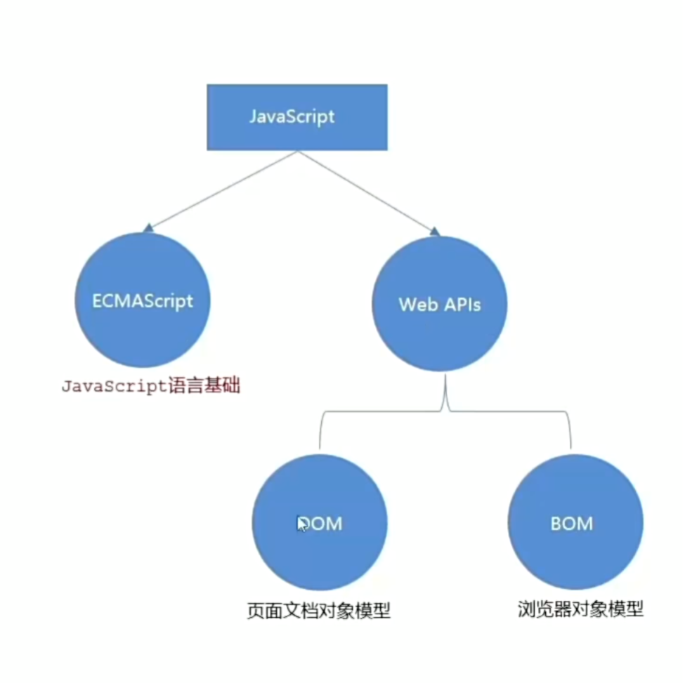

# javascript

## 何为编程？

### 编程即编写程序

编写：通过在word,vsc,记事本等编辑器上编写并保存为有特定后缀的文件  

程序：（泛指网站 脚本 软件 系统 之类的东西）分为数据和函数两个部分

**数据：具体为数字 文字 图片 视频（即保存在硬盘中的电子）**

**函数：（具体为点击 滑动 计算 运行等交互；类似于功能） 接受输入参数-->处理参数-->输出结果的过程（函数可以套娃嵌套）**

### 编程就是是编写函数去处理数据

**由数据量大小和处理逻辑的复杂程度决定其难度**

***判断为处理参数中最重要的处理方法***

### 编程的核心为函数计算的过程

其由运算符号（+-*/等）和控制结构（判断 循环等）构成

### 现实中的许多东西都可以看为特别复杂的程序（由各种函数嵌套而成）

***例如学习就是增加我们数据量并优化处理数据的函数的过程***

---


## js语言

### 是什么

一种运行在客户端（浏览器）的编程语言，实现人机交互

属于弱数据类型语言，变量属于哪种类型，只有赋值之后，才能确认

java是强数据类型     例如： int a = 3     必须是整数

### 作用

+ 网页特效（监听用户行为作出对应反馈）
+ 表单验证（针对表单数据合法性进行判断）
+ 数据交互（获取后台数据，渲染到前端）
+ 服务端编程（node.js）

### js组成



#### ECMAScript

规定js核心语法知识，如：变量，分支语句，循环语句，对象等

#### Web APIs

DOM操作：文档，比如对页面元素进行移动、大小、添加删除等操作

eg:留言，评论

BOM操作：浏览器，比如页面弹窗，检测窗口宽度、存储数据到浏览器等等

### 书写

#### 插入

+ 内部：写在</body>上方（浏览器按顺序加载）``

```javascript
<script>
    alert('弹窗提示')
</script>
```

+ 外部js

```javascript
<script src="my.js"></script>
```

**外部js中间不要写代码**

+ 内联js

```javascript
<button onclick='alert'('逗你玩~~~')>点击我月薪过万</button>
```

#### 注释

+ **注释：单行`//`     多行`/**/`）**

#### 结束语

+ 结束语     ;     可写可不写但要统一

### 输入与输出

#### 输出

1.document.write(`我是div标签`)/（`<h1>我是一级标题</h1>`）**注意反引号**

作用：1.向body页内输出内容

​           2.输出标签，可解析为网页元素

2.alert(‘要出的内容’)

作用：页面弹出警告对话框

3.console.log(‘控制台打印’)

`console.log(age)`

作用：控制台输出语法，供调试用

#### 输入

1.prompt(‘请输入你的年龄： ’)

作用：包含提示信息，提示用户输入文字

#### 字面量

定义：描述事或物

eg:1.工资1000      数字字面量；

​     2.“字符串”        字符串自变量； 

​     3.[]                    数组字面量；

​     4.{}                   对象字面量

​     5.true false     布尔型字面量

### 变量

定义：存储数据的容器

本质：程序在内存中申请的一块用来存放数据的小空间

内存：不同于硬盘，关机后即消失，是实时的

#### 声明和赋值

+ let 变量名 = 值

```javascript
let age
age = 18
let name = "字符串"
```

```javascript
//不可重复声明相同变量
let age = 18
    age = 19
console.log(age)
```

```javascript
//声明多个变量
let age = 18, uname = 'pink'
//更推荐多行声明
```

**规则**

1.不能用关键字命名

2.数字不开头     可用下划线字母$开头

3.严格区分大小写

**规范**

1.起名有意义

2.驼峰命名     myName

#### let 和 var的区别

var:

1.可以先使用再声明

2.可以重复声明变量

3.污染全局变量，没有块级作用域

#### 数组

格式：`let key = ['小明','小红','小白']`     `let arr = [10,20,30]`

特性：有序                     0           1           2                                     0    1    2   （索引或下标）

使用：`console.log(arr[0])`

### 常量

注意：常量不许重新赋值，且在声明时就应对其初始化

**声明** `const age = 18`

### 数据类型

#### 基本数据类型

+ number          数字型

​       整数，小数，正数，负数

​       运算符号与其他语言一样

+ string              字符串型 

​       使用     ‘ ’   “ ”    包裹的数据                                  **或为用户输入内容**

​      **字符串拼接**

​      `console.log('王' + '八蛋')`                    输出          王八蛋

​      `console.log('我今年' + age)`                 可以连接字符串和其他数据类型包括变量

​      `console.log('我今年${age}岁了')`          还可以内嵌变量

**‘’单引号字符串不能插入变量，``模板字符串才能插入${变量}$**

+ boolean          布尔型

​       只有两个值     true      false

​       `let treeFalse = true`

​       `console.log( 3 > 4 )`         输出为false


+ undefined      未定义型

​       在声明变量不赋值的情况下，变量默认值为undefined，一般很少为某个变量赋值undefined

​       作用：通过检测变量值是否为此，判断用户是否发送数据

```javascript
let num
console.log(num)
```

​       若`console.log(undefined + 1)`将会输出 NaN (Not a number)

+ null                  空类型

​       仅仅代表“无”、“空”   或     “值未知”    的特殊值

​      `let obj = null`

与undefined的区别：undefined表示没有赋值

​                                      null表示赋值了，但是内容为空（没想好赋啥值先给个空）

#### 引用（检测）数据类型

+ object             对象                      

​                                       typeof 关键字检测数据类型

​                                       作用：返回被检测的数据类型

​                                       语法：   typeof x

​                                       typeof(x)

```javascript
let num = 10
console.lopg(typeof num)              输出number
let str = 'pink'
console.log(typeof str)               输出string
```

### 类型转换

使用表单、prompt获取的数据默认为字符串类型

`console.log('1000' + '200')`      输出为1000200        不能进行正常加减

#### 隐式转换

`console.log(1 + 1)`                     输出2

`console.log('pink' + 1)`          输出 pink1        系统自动将1转换为字符串

`console.log(2 - '2')`                输出0                  -将‘2’转换为数字

`console.log(+'123')`                  输出123             +将 ’123’ 转换为数字

**除+以外的其他运算符会自动将其转换为数字类型**

#### 显式转换

主动转换（转换为数字类型）

+ Number                             转换为数字12.35
+ parseInt                             只保留整数12
+ parseFloat                         可以保留小数12.35

```javascript
let num = '123'
console.log(Number(num))//输出为123
let num = Number(prompt('请输入数字'))
let num = +prompt('请输入数字')
console.log(Number('pink'))//输出NaN
```

### 运算符

#### 赋值与自增

+ 与C语言一致
+ 如++i/i++    常用于计操作次数 

       ```JavaScript
       let a = 1
       console.log(++i + 1)      输出3 //先自加再运算
       let b = 1
       console.log(i++ + 1）     输出2 //先运算再自加
       console.log(i)            输出2
       ```

#### 比较

**只返回true/false**

+ 一般与C一致

+ == 左右两边值是否相同
+ ===类型和值是否相同
+ ！==左右两边是否不全等

**内有隐式转换，将字符3转换为数字3再比较，但类型不同**

+ 字符串比较A码，从第一个字母开始比，相同就比第二个，中文会转化为拼音

#### 逻辑

+ && 逻辑与（并且）     要求两边都为真
+ ||  逻辑或（或者）     要求有一方真
+ ！  逻辑非（取反）      真变假，假变真

### 语句

**与表达式的区别**

不一定有值

+ 顺序结构：从上往下
+ 分支结构：条件
+ 循环结构：条件

#### 分支语句

**非0，‘’为真**（包括字符串）

##### if

  单分支，一个主体if

  双分支，if     +     else

```javascript
if(){
    
}else if(){
    
}else if(){
    
}else{
}
```


##### 三元

​               格式：条件？代码1:代码2     若为真则为代码1反之代码2

         ```javascript
         console.log('(3 > 5 ? 3 : 5)')
         ```

​              使用：相当于双分支if     一般用来取值

`let a = 3 > 5 ? 3 : 5`


##### switch

​                   使用：一般用于等值判断，而不是区间判断

​                   注意：break，否则造成case穿透

                   ```javascript
                   switch(变量){
                       case 值:
                           代码
                         break
                       case 值:
                           代码
                         break
                       default:
                           代码
                         break
                   }
                   ```

#### 循环语句

##### while

```javascript
while(循环条件){
    代码(循环体)
}
```

注意：无终止条件会变成死循环

##### 循环退出

+ break                退出循环

```javascript
let i = 1;
            while (i <= 5) {
                if (i === 3) {
                    break;
                } //退出整个循环}
                console.log(`我要吃第${i}个包子`);
                i++;
            }
```

用于得到结果后排除某循环

+ continue           结束本次循环，继续下次循环

  ```javascript
  while (i <= 5) {
                  if (i === 3) {
                      i++//若无i++，会因为i永远等于3变成死循环
                      continue;
                  } //退出整个循环}
                  console.log(`我要吃第${i}个包子`);
                  i++;
              }
  ```

  用于排除某个循环

##### for


