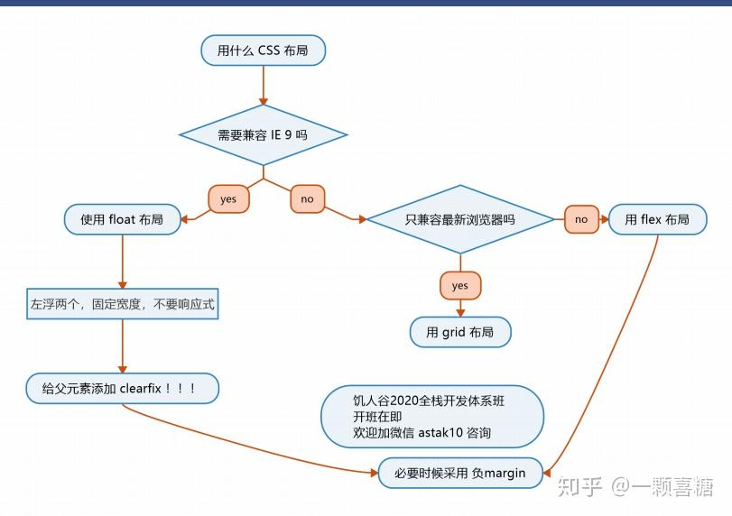
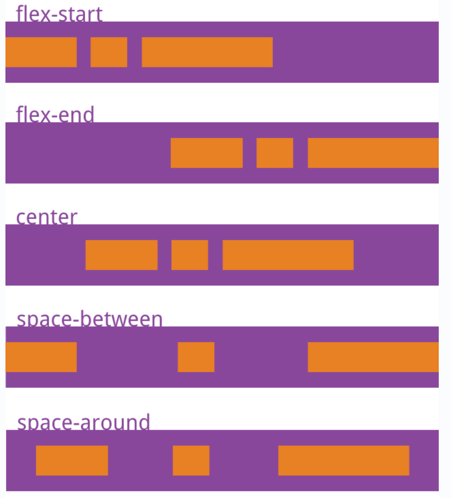
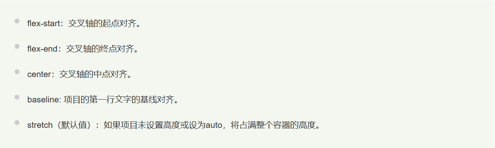

# 边界塌陷

## 同时给兄弟/父子元素设定上下边距，理论是两者之和，实际显示只有一半

**_浮动和定位并不会发生塌陷_**

**_只有块级元素垂直方向上才会产生 margin 合并_**

## margin 同为负数或正数取绝对值最大的；margin 一正一负就取和

## 对于父子元素边界塌陷（当给子元素设置外边距时父子共用边距相当于单独给父元素设置外边距）

**_父元素：1.调整内边距 2.overflow：hidden_**

**（触发 bfc “float 不为 none
overflow 不为 visible（常用 overflow:hidden）
position 为 fixed，absolute
display 为 flex，inline-block，table-cell” **

**_使其被看作一个隔离元素，不影响其他元素）_**

**_子元素：1.display：inline-block 2.overflow：hidden 3.float 和 position_**

# 布局

## float 布局基本被淘汰

## flex

## 容器属性

flex-direction;

flex-wrap;

flex-flow(flex-flow:<flex-direction> <flex-wrap>);

justify-content;

**space-evenly(包含容器取各项目间距相等)**

align-items;

align-content（定义多行项目在交叉轴的对齐方式）

## 项目属性

order:1/2/3 定义项目排序顺序

align-selfs:（类似 align-items,但只对单个项目生效）

flex: flex-grow flex-shrink flex-basis
