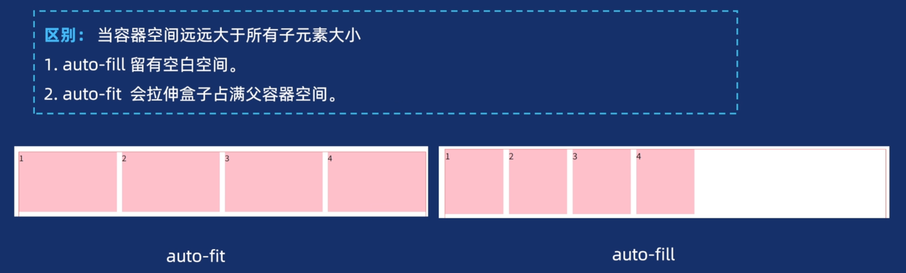

# 边界塌陷

## 同时给兄弟/父子元素设定上下边距，理论是两者之和，实际显示只有一半

**_浮动和定位并不会发生塌陷_**

**_只有块级元素垂直方向上才会产生 margin 合并_**

## margin 同为负数或正数取绝对值最大的；margin 一正一负就取和

## 对于父子元素边界塌陷（当给子元素设置外边距时父子共用边距相当于单独给父元素设置外边距）

**_父元素：1.调整内边距 2.overflow：hidden_**

**（触发 bfc “float 不为 none
overflow 不为 visible（常用 overflow:hidden）
position 为 fixed，absolute
display 为 flex，inline-block，table-cell” **

**_使其被看作一个隔离元素，不影响其他元素）_**

**_子元素：1.display：inline-block 2.overflow：hidden 3.float 和 position_**

# 幽灵字符

## 原因

html中     **空格与换行是有意义的**     会产生一个的空白字符

## 出现场景

在给两个盒子分别设定`width:50%`时，会出现换行显示而不是并行显示

## 解决

1. 修改宽度为49%（较粗糙）
2. 并列子元素（不推荐）
3. 设定父元素font-size为0（最优）

# padding hack

作用：保持非可替代元素的长宽比

 ``` css
        
.aspect-ratio-hack {
        position: relative;
   
        padding-top: 56.25%;
      }
 
      .inner {
        background-color: pink;
        position: absolute;
        top: 0;
        right: 0;
        bottom: 0;
        left: 0;
      }

 ```

aspect-ratio: auto  /

auto： 默认值，它指定元素没有首选的纵横比，应该像往常一样调整自己的大小。因此，替换元素，如具有固有纵横比的图像，使用 该 纵横比。
<ratio>: 由正斜杠 ( /)分隔的两个正数值，它们周围有或没有空格，目标是元素的宽度和高度。在单个值的情况下，第二个值被认为是 涉及首选纵横比的大小计算适用于指定的框的尺寸 box-sizing。
initial： 应用属性的默认设置，即auto。
inherit： 采用aspect-ratio父级的值。
unset： 从元素中删除当前的纵横比。

# 布局

## float 布局基本被淘汰

## flex

### 适用范围：线性布局

### 容器属性

flex-direction;

flex-wrap;

flex-flow(flex-flow:<flex-direction> <flex-wrap>);

justify-content：


**space-evenly(包含容器取各项目间距相等)**

align-items;


align-content（定义多行项目在交叉轴的对齐方式）

### 项目属性

order:1/2/3 定义项目排序顺序

align-selfs:（类似 align-items,但只对单个项目生效）

flex: flex-grow flex-shrink flex-basis

## grid

### 适用范围：

二维布局

### 核心：

**先创建网格再填入项目**

### 设置：

display:grid(块级垂直排列)/inline-grid(水平排列){默认只有一列}

### 网格轨道

#### 显式网格

定义列：grid-template-columns:150px 200px 300px 三列

定义行：grid-template-row:100px 100px 100px 三行

单位：

​           1.%响应布局 

​           2.fr 类似flex:1 

​           3.auto 随内容变化

​           4.repeat(3,250px)/repeat(5,2fr)

​              **自动填充：适用响应式布局列数随宽度**

​              repeat(自动填充，轨道尺寸)

​                  auto-fill:  尽可能多地创建列。

​                  auto-fit：尽可能拉伸列填满容器（会合并空白，列宽不小于minmax的最小值）



​           5.minmax(min,max)定义最小最大(2px,2fr)

#### 隐式网格

如果在定义的网格外放置内容，或者由于内容太多，需要更多的网格轨道，那么网格就会在隐式网格中创建行和列。默认情况下，这些轨道会自动调整大小，因此它们的大小取决于轨道内的内容。

使用： [`grid-auto-rows`](https://developer.mozilla.org/zh-CN/docs/Web/CSS/Reference/Properties/grid-auto-rows) 和 [`grid-auto-columns`](https://developer.mozilla.org/zh-CN/docs/Web/CSS/Reference/Properties/grid-auto-columns) 属性可以为在隐式网格中创建的轨道定义设定大小。

#### 对齐（控制列与行轨道）

##### 对齐（单元格）

justify-content：控制列轨道在容器水平分布

align-content:     控制行轨道在容器水平分布

attribute（属性有）:start(默认) end(末尾) center（居中） space-around(中间等距离分开)

​                                   space-between(首尾贴边)              space-evenly沿行列等分

##### 对齐（单元格内元素）

  (水平对齐）justify-items:

（垂直对齐）   align-iems:

（结合）        place-items：水平 垂直

attribute（属性有）：stretch（默认）拉伸填满单元格

​                                       center                水平居中对齐

​                                       start                   对齐单元格起始边缘

​                                       end                    对齐单元格结束

#### 网格线（跨界）

作用：实现盒子的跨行与跨列

行/列线数由     行/列数+1     从左到右从上往下

**设置在子元素身上**

实现：grid-column:1/3     从第一列到第二列（及从第一列线到第三列线）

​           grid-row:1/3     同理


​          grid-row:1/span 2     跨两个单元格与1/3同理


​          grid-column-start:1

​          grid-column-end:5     从第一列线到第五列线

#### 网格填充顺序（grid-auto-flow）

类似：flex-direction

grid-auto-flow:row     先行后列（默认）

grid-auto-flow:column     先列后行 


#### 定义网格区域

作用于子元素

语法：grid-area:1/1/1/1

其值从左到右分别代表着（grid-column-start: 1;  grid-column-end: 1;  grid-row-start: 1;  grid-row-end:1）


​    

#### object

**object-fit**

使用：需要img图片具有明确高度与宽度

fill              默认值。拉伸内容以完全填充容器，不保持宽高比，可能导致内容变形（最常用但需谨慎）。
contain     保持内容固有宽高比，缩放至完全适应容器内部（内容全部可见），容器可能有空白（类似“适应”模式）。 
cover        保持内容固有宽高比，缩放至覆盖容器（内容可能部分被裁剪），容器无空白（类似“填充”模式）。

**object-position**

作用：控制图片位置

与常用方位名词搭配     

object-position: 50% 50%;（水平，竖直）

object-position: right top;                                        

object-position: left bottom;                                       

object-position: 250px 125px;

## column

### 应用：

瀑布流，长文章分栏

### 属性

column-count:num     自动分配列宽

column-gap                  列间距

column-rule                 列分割线样式（类似border）

### 底部元素被切割

原因：其本质是将内容按垂直方向自动分割到多列

**解决方案：break-inside：avoid-column    强制元素不跨行分列**

## position

### 适用范围

### 属性

### static

默认属性

### fixed

固定定位

+ 应用：需脱离文档流固定在窗口固定位置的元素

  如：导航栏，广告

+ top/bottom,left/right

### stick

粘性定位

+ 应用：
+ 吸顶效果。元素在滚动到某个位置后固定。
  表格表头固定。长表格滚动时表头始终可见
+ 1. 元素在滚动到指定位置（如top：10px）前为相对定位，之后转为固定定位
  2. 父容器的overflow需为visible，否则粘性定位失效
  3. 可以通过top、bottom、let、right属性进行偏移
  4. 须指定top，right,bottom或left四个其中之一，才可使粘性定位生效

### relative

相对定位

+ 应用：作为absolute定位父元素
+ 偏移原位置，但任然占据原位置空间
+ top/bottom,left/right

### absolute

绝对定位

+ 应用：弹出菜单/下拉框等需覆盖其他元素的场景
+ 相对于基准（已定位父元素（除static））移动，不占据空间
+ top/bottom,left/right

### z-index

+ 场景：

1. 提高层级悬浮效果。
2. 实现图片层叠效果。

+ 语法：

1. 值类型：整数（正数、负数、零）或auto。数值越大，层级越高
2. 默认值：auto（等同于未设置，后出现的元素覆盖前者）。
3. 生效条件：仅对定位元素（position值为relative、absolute、fixed或sticky）有效。

# 单位

## px

定义：绝对单位

使用：当设定字体大小时font-size，要顺便设置行距line-height

## em

定义：相对单位（相对自身）

 ```css
 body{
 font-size:20px}
 p{
 font-size:2em}/*此时字体大小为40px，为原本大小的两倍*/
 ```

## rem

定义：相当单位（相对于根元素）

使用：更加易于计算

## vh/vw

定义：相对单位（窗口）

使用：1-100

## vmin/vmax

定义：相对单位

使用：(1-100))vmin代表元素占据画面较短一边作为长度参照

​                         vmax画面较长的一边

**常用作响应式**

## %

定义：占据父元素的多少

使用：响应式


# 动画

## transform：

translate(水平，垂直)    若用%则表示相对于盒子自身移动

rotate(30deg)     顺时针旋转

**{可以用(transform-origin:top left     >>>    从左和上数意味着top=0%,left=0%)修改    旋转    缩放    倾斜等效果基点}**

scale(0.5,1.5)     水平，竖直缩放为原来的几倍

skew(30deg,50deg)      水平，垂直倾斜度数

matrix(a,b,c,d,e,f)     a,d控制缩放     b,c控制倾斜     e,f控制平移

## transition

作用：属于补间动画，须设置起始帧与关键帧，让过渡更自然

组成：transition：参与属性，持续时间，过渡类型，延迟播放时间

### transition-property

transition-property：none/all/property      

property：定义应用过渡效果的 CSS 属性名称列表，多个属性名称之间使用逗号`,`进行分隔。width,length

### transition-duration

transition-duration:0.5s,0.6s     规定多个属性的过渡时间

### transition-timing-function

- `ease` - 规定过渡效果，先缓慢地开始，然后加速，然后缓慢地结束（适合大部分效果）
- `linear` - 规定从开始到结束具有相同速度的过渡效果（适合机械感效果，如进度条）
- `ease-in` -规定缓慢开始的过渡效果（弹窗）
- `ease-out` - 规定缓慢结束的过渡效果（关闭动画）
- `ease-in-out` - 规定开始和结束较慢的过渡效果（对称性切换，如页面切换）
- `cubic-bezier(x1,y1,x2,y2)` - 允许您在三次贝塞尔函数中定义自己的值


### transition-delay

设置过渡效果何时开始

## animation

组成：animation:名字，持续时间，过渡类型，延迟时间，播放次数，方向

### animatiion-name

`animation-name`：指定一个或多个 @keyframes 的名称，描述了要应用于元素的动画。多个 @keyframes 以逗号分隔的名称列表的形式指定。

### animation-delay

`animation-delay`：指定执行动画之前的等待时间。动画可以稍后开始、立即从开头开始、立即在动画中途播放 **(如 `-1s`)**。其中 `-1s` 意思是动画立即从 1s 处开始。

### animation-iteration-count

`animation-iteration-count`：设置动画序列在停止前应播放的次数，有效值 `0`、正整数、正小数、无限循环 `infinite`

### animation-direction

`animation-direction`设置动画是正向播放 `normal`、反向播放 `reverse`、正向交替播放 `alternate`、反向交替播放 `alternate-reverse`

### animation-play-state

`animation-play-state`：设置动画是运行还是暂停，有效值 `running`、`paused`。

### animation-fill-mode

`animation-fill-mode`：设置 CSS 动画在执行之前和之后如何将样式应用于其目标，有效值如下：

- `none`：当动画未执行时，动画将不会将任何样式应用于目标，而是已经赋予给该元素的 CSS 规则来显示该元素。这是默认值
- `both`：动画将遵循 `forwards` 和 `backwards` 的规则，从而在两个方向上扩展动画属性
- `forwards`：目标将保留由执行期间遇到的最后一个关键帧计算值。最后关键帧取决于 `animation-direction` 和 `animation-iteration-count`：

| animation-direction | animation-iteration-count | last keyframe |
| ------------------- | ------------------------- | ------------- |
| normal              | even or odd               | 100%          |
| reverse             | even or odd               | 0%            |
| alternate           | even                      | 0%            |
| alternate           | odd                       | 100%          |
| alternate-reverse   | even                      | 100%          |
| alternate-reverse   | odd                       | 0%            |

+ `backwards`：动画将在应用于目标时立即应用第一个关键帧中定义的值，并在 `delay` 期间保留此值。第一个关键帧取决于 `animation-direction` 值：

| animation-direction          | first keyframe |
| ---------------------------- | -------------- |
| normal or alternate          | 0%             |
| reverse or alternate-reverse | 100%           |

### animation-timing-function

`animation-timing-function`：设置动画在每个周期的持续时间内如何进行，主要是如下两种函数：

#### cubic-bezier

- `cubic-bezier` 三次贝塞尔曲线 ( `cubic-bezier(<x1>, <y1>, <x2>, <y2>)` )，以实现 **补间动画** 效果。

1. **linear**：`cubic-bezier(0.0, 0.0, 1.0, 1.0)`
2. **ease**：`cubic-bezier(0.25, 0.1, 0.25, 1.0)`
3. **ease-in**：`cubic-bezier(0.42, 0.0, 1.0, 1.0)`
4. **ease-out**：`cubic-bezier(0.0, 0.0, 0.58, 1.0)`
5. **ease-in-out**：`cubic-bezier(0.42, 0.0, 0.58, 1.0)`            

#### steps

- `steps` 是一个分段的阶跃函数，，以实现 **逐帧动画**。n 相当于单次动画的帧数，每帧动画的时间是均等的 (`steps(n, <jumpterm>)`)，其中 `jumpterm (默认值 end)` 含义如下：

1. jump-start：在起始位置阶跃，`n=2 ⇒ 50% 100%; (100 / 2)`
2. jump-end：在结束位置阶跃, `n=4 ⇒ 0% 25% 50% 75%; (100 / 4)`
3. jump-none：起止位置均无跳跃，`n=5 ⇒ 0% 25% 50% 75% 100%; (100 / 4)`
4. jump-both：起止位置均有跳跃 `n=3 ⇒ 25% 50% 75%; (100 / 4)`
5. start：等同 jump-start
6. end：等同 jump-end
7. step-start：等同 steps(1, jump-start)
8. step-end：等同 steps(1, jump-end)

`steps` 函数动画示意图如下（输入为时间进度，输出为动画进度）


### @keyframes

```text
@keyframes slidein {
    0% {
      margin-left: 100%;
      width: 300%;
    }
    100% {
      margin-left: 0%;
      width: 100%;
    }
  }
```

